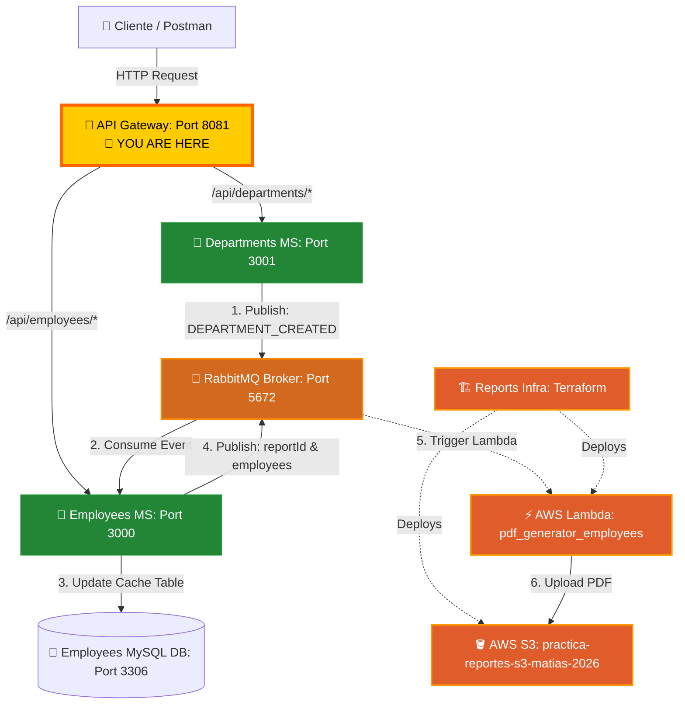

# 🔀 Employees API Gateway

<p align="center">
  
  
  
  
  
</p>

---

## 📝 Description

This project serves as the centralized **API Gateway** for a practice microservices architecture (`microservicio_practice`). Its primary goal is to act as a single entry point for client applications, abstracting the network complexity and routing HTTP requests efficiently to their corresponding backend microservices.

It is built using **Express 5**, **TypeScript 6**, and **http-proxy-middleware**, ensuring strong static typing, robustness, and high-performance routing.

---

## 🔗 Connected Repositories

This project belongs to a multi-repository microservices ecosystem. Ensure you have all repositories cloned for full integration:

*   **API Gateway (This repo):** [employees_api_gateway](https://github.com/MNATorres/employees_api_gateway.git)
*   **Departments Microservice:** [departments_ms](https://github.com/MNATorres/departments_ms.git)
*   **Employees Microservice:** [typescript-exercises](https://github.com/MNATorres/typescript-exercises.git)
*   **PDF Generator (AWS Lambda):** [pdf_generator_employees](https://github.com/MNATorres/pdf_generator_employees.git)
*   **Reports Infrastructure (Terraform):** [reports_infra_ms](https://github.com/MNATorres/reports_infra_ms.git)

---

## 🏗️ System Architecture & Message Flow

The API Gateway acts as the HTTP entry point, routing requests to internal microservices, while **RabbitMQ** orchestrates event-driven flows (Pub/Sub database synchronization and report generation triggers) and **AWS** components handle serverless PDF storage.



---

## ✨ Features

*   **Reverse Proxy Routing:** Transparently forwards requests to backend services without exposing their ports to the external network.
*   **No Global Body Parsing:** Avoids global `express.json()` parser middleware to prevent request stream corruption, allowing target microservices to receive the payloads directly.
*   **Infrastructure Hosting:** Houses the central dockerized **RabbitMQ** message broker configuration.
*   **TypeScript Ready:** Compiles with modern `tsconfig` configurations and runs in development with `tsx` hot-reloading.

---

## 🐇 RabbitMQ Deep Dive & Pub/Sub Mechanism

In this distributed system, microservices need to share certain data while remaining loose-coupled. Instead of querying each other synchronously via HTTP, they use **RabbitMQ** to publish and subscribe to events.

### How it Works in Our Architecture:
1.  **Publishing Events (Publisher - Departments MS):**
    When a user creates a new department by sending a `POST` request to `http://localhost:8081/api/departments`, the **Departments Microservice** writes it to its database. Upon success, it publishes a `DEPARTMENT_CREATED` event containing the department ID (`dept_no`) and name (`dept_name`) to RabbitMQ.
2.  **Message Queueing (Broker - RabbitMQ):**
    RabbitMQ receives the message and stores it securely inside a durable queue named `departments_events`. The queue is marked as `durable: true`, and messages are `persistent: true`, meaning they survive broker crashes or restarts.
3.  **Consuming Events (Subscriber - Employees MS):**
    The **Employees Microservice** runs a background listener subscribed to the `departments_events` queue. Once RabbitMQ delivers the message, the Employees service:
    *   Inserts or updates the department record in its local `departments_cache` SQL table.
    *   Sends a message acknowledgement (`ack`) back to RabbitMQ.
    *   If any database error occurs during caching, it skips sending the `ack` so the message is kept safe in the queue to be retried later.

### Architecture Benefits:
*   **Loose Coupling:** The Departments Microservice does not need to know about the Employees Microservice's database layout, server address, or internal APIs.
*   **High Resilience:** If the Employees Microservice goes offline, the Departments Microservice can still create departments normally. The events will simply pile up in RabbitMQ and will be consumed immediately once the Employees Microservice returns online.
*   **Eventual Consistency:** Databases remain synchronized asynchronously in the background.

---

## 🚀 Local Testing & Running the Ecosystem

To test the microservices flow locally, **all three repositories and their respective databases/brokers must be running concurrently.**

### Step-by-Step Setup:

#### 1. Clone & Organize Directories
Clone all three repositories into the same parent folder:
```bash
git clone https://github.com/MNATorres/employees_api_gateway.git
git clone https://github.com/MNATorres/departments_ms.git
git clone https://github.com/MNATorres/typescript-exercises.git
```

#### 2. Spin up Docker Containers
You must run the Docker containers in all three projects to launch the databases and RabbitMQ. Open terminal windows inside each directory and execute:
*   **In `api_gateway` (Starts RabbitMQ):**
    ```bash
    docker compose up -d
    ```
    *   **Port 5672:** AMQP protocol used by code to communicate.
    *   **Port 15672:** RabbitMQ Management Web Interface (username: `guest` | password: `guest`). Open [http://localhost:15672](http://localhost:15672) to monitor queues.
*   **In `departments_ms` (Starts Departments MySQL):**
    ```bash
    docker compose up -d
    ```
    *   **Port 3307:** MySQL connection.
    *   **Port 8082:** phpMyAdmin interface at [http://localhost:8082](http://localhost:8082).
*   **In `typescript-exercises` / `employes_ms` (Starts Employees MySQL):**
    ```bash
    docker compose up -d
    ```
    *   **Port 3306:** MySQL connection.
    *   **Port 8080:** phpMyAdmin interface at [http://localhost:8080](http://localhost:8080).

#### 3. Setup Environments (`.env`)
Make sure each directory has its `.env` file configured:
*   **API Gateway (`api_gateway/.env`):**
    ```env
    PORT=8081
    EMPLOYEES_SERVICE_URL=http://localhost:3000
    DEPARTMENTS_SERVICE_URL=http://localhost:3001
    ```
*   **Departments MS (`departments_ms/.env`):**
    ```env
    PORT=3001
    DB_HOST=localhost
    DB_PORT=3307
    DB_USER=root
    DB_PASSWORD=password
    DB_DATABASE=departments
    ```
*   **Employees MS (`employes_ms/.env`):**
    ```env
    PORT=3000
    DB_HOST=localhost
    DB_PORT=3306
    DB_USER=root
    DB_PASSWORD=password
    DB_DATABASE=employees
    ```

#### 4. Install Dependencies & Launch Services
Install npm dependencies and start the development servers:
*   **Employees MS:**
    ```bash
    cd employes_ms
    npm install
    npm run dev
    ```
*   **Departments MS:**
    ```bash
    cd departments_ms
    npm install
    npm run dev
    ```
*   **API Gateway:**
    ```bash
    cd api_gateway
    npm install
    npm run dev
    ```

#### 5. Verify and Test the Sync
1.  Open your Postman or API testing tool.
2.  Send a `POST` request to register a department via the **API Gateway**:
    *   **URL:** `POST http://localhost:8081/api/departments`
    *   **Headers:** `Content-Type: application/json`
    *   **Body:**
        ```json
        {
          "dept_no": "d999",
          "dept_name": "Antigravity Engineering"
        }
        ```
3.  Check the console logs of **Departments MS**: You will see `📣 Event published to queue [departments_events]`.
4.  Check the console logs of **Employees MS**: You will see `📩 Event received from queue: DEPARTMENT_CREATED` and `💾 Cache updated in DB: d999 -> Antigravity Engineering`.
5.  Access phpMyAdmin for the Employees database at `http://localhost:8080` and verify the `departments_cache` table contains the new department!

---

## ⚙️ Configuration (.env)

| Variable | Type | Description | Default Value |
| :--- | :--- | :--- | :--- |
| `PORT` | Number | Port on which the API Gateway listens. | `8080` (if unconfigured) |
| `EMPLOYEES_SERVICE_URL` | URL | Base URL of the Employees Microservice. | `http://localhost:3000` |
| `DEPARTMENTS_SERVICE_URL` | URL | Base URL of the Departments Microservice. | `http://localhost:3001` |

---

## 📡 Endpoints Exposed

| Path | Method | Target Service URL | Description |
| :--- | :--- | :--- | :--- |
| `/api/employees/*` | `ANY` | `EMPLOYEES_SERVICE_URL` | Forwards all requests to Employees Microservice |
| `/api/departments/*` | `ANY` | `DEPARTMENTS_SERVICE_URL` | Forwards all requests to Departments Microservice |

---

## 📂 Directory Structure

```bash
api_gateway/
├── src/
│   └── index.ts          # Express Gateway setup and proxies
├── .env                  # Port and backend URL configurations
├── docker-compose.yml    # Runs local RabbitMQ broker
├── package.json          # Dependencies and scripts
├── tsconfig.json         # TS configurations
└── README.md             # This documentation
```

---

> [!IMPORTANT]
> **Body Parser Warning:**
> For proxy forwarding to work correctly, this gateway **must not** apply `express.json()` globally. Parsing incoming requests at this stage consumes the stream, which blocks proxy modules from forwarding payload bodies on `POST` and `PUT` requests.

---

## 📄 License

This project is licensed under the ISC License.
